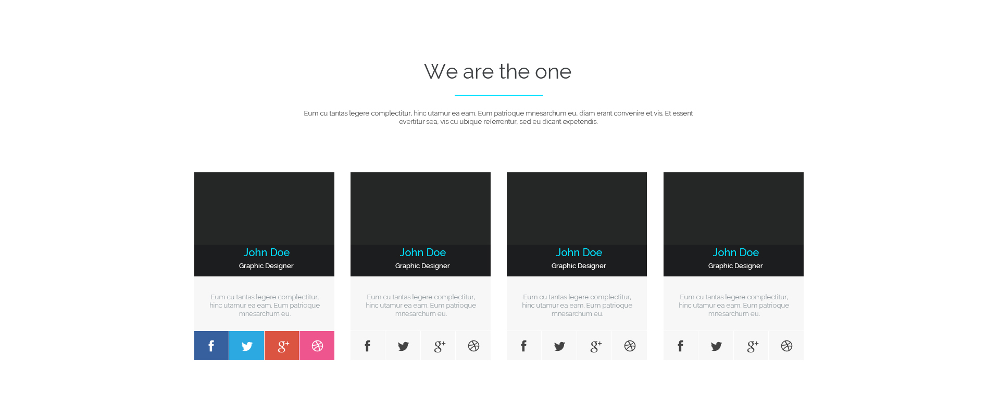
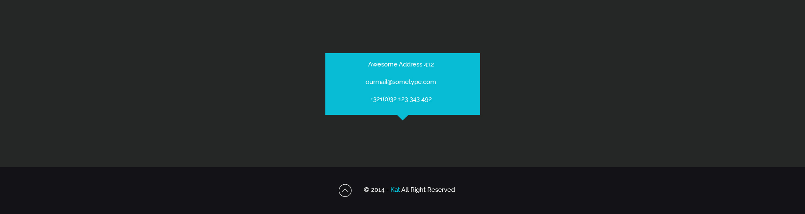

# Ng2ket

This project was generated with [angular-cli](https://github.com/angular/angular-cli) version 1.0.0-beta.19-3.

## Development server
Run `ng serve` for a dev server. Navigate to `http://localhost:4200/`. The app will automatically reload if you change any of the source files.

## Code scaffolding

Run `ng generate component component-name` to generate a new component. You can also use `ng generate directive/pipe/service/class`.

## Build

Run `ng build` to build the project. The build artifacts will be stored in the `dist/` directory. Use the `-prod` flag for a production build.

## Running unit tests

Run `ng test` to execute the unit tests via [Karma](https://karma-runner.github.io).

## Running end-to-end tests

Run `ng e2e` to execute the end-to-end tests via [Protractor](http://www.protractortest.org/).
Before running the tests make sure you are serving the app via `ng serve`.

## Deploying to Github Pages

Run `ng github-pages:deploy` to deploy to Github Pages.

## Further help

To get more help on the `angular-cli` use `ng --help` or go check out the [Angular-CLI README](https://github.com/angular/angular-cli/blob/master/README.md).

##Задача 
* Создание сайта-портфолио веб-студии по предоставленному psd макету. 

##Общие требования к сайту 
* Корректное отображение сайта на следующих разрешениях экрана: 320px, 687px, 992px, 1200 px 
* Поддержка браузеров: последние версии Chrome, Firefox, Safarі, Opera, MS Edge. 
* Для реализации функционала сайта используйте AngularJS. 

##Структура сайта: 
###Header
  

* Меню дожно быть зафиксировано в верхней части экрана, чтобы пользователь мог им всегда воспользоватся. 
* При нажатии на каждый элемент меню страница плавно прокручивается до соответствующего блока на странице. 
* При нажатии на кнопку start tour страница плавно прокручивается до блока портфолио.  
* Для реализации плавной прокрутки страницы напишите свой сервис AngularJS или используйте сторонние ресурсы(например, https://github.com/d-oliveros/ngSmoothScroll).

 
###Блок с описанием сервисов
 

* При клике по каждой из иконок сервисов открывается вкладка с текстом описания сервиса(для решения задачи используйте произвольный текст и директиву ng-switch). По умолчанию открыта первая вкладка. 
* При нажатии на кнопку get now страница плавно прокручивается до блока контактов. 

###Блок портфолио 

* Добавьте произвольные изображения в портфолио. 
* Реализуйте фильтрацию изображений по категориям(для решения задачи создайте фильтр AngularJS).  
* При наведении курсора мыши на изображение над ним появляется полупрозрачный слой с информацией о том к какой категории относится данное изображение. 

###Блок со статистикой достижений 

* Когда блок только появился в видимой области страницы, течении 3 секунд происходит отсчет от 0 до значений, указанных в макете.
* Для решения задачи используйте директиву AngularJS. 

###Блок about us 

* Добавьте произвольное фото для членов команды. 
* При наведении мыши на иконки ссылок социальных сетей они меняют цвет: 

* Реализуйте блок с помощью директивы. 

###Блок новостей 

* Загрузите описание новостей из JSON-файла(файл data.json в папке project). 
* Для отображения новостей на странице используйте директиву ng-repeat и одностороннюю привязку данных. 
* При нажатии на текст read more выполняется переход по пути '/id', где id - id новости. На открывшейся странице отображается дата и текст новости. 
* Маршрутизацию нужно реализовать без перезагрузки страницы. 

###Блок контактов 

* Форма с полями Name, Email, Message. Валидация формы происходит при нажатии на клавиши. При вводе пользователем некорректных данных в поле ввода под этим полем сразу отображается сообщение об ошибке. Сообщение об ошибке сразу же скрывается, если пользователь ввел корректные данные. 
* В поле Name допускаются только буквы английского алфавита.
* В поле Email допускаются толко буквы английского алфавита, цифры, знак подчеркивание и симвом @. 
* В поле Message допускаются любые символы. Минимальная длина сообщения - 20 символов. 

* При отправке формы значения полей Name и Email сохраняются в cookies. 
* При следующем заходе пользователя на страницу сохраненные данные используются для автозаполнения полей Name и Email. 

###Footer
 

* Копирайт и кнопка вврех. 
* При нажатии на кнопку страница плавно прокручивается в начало. 

